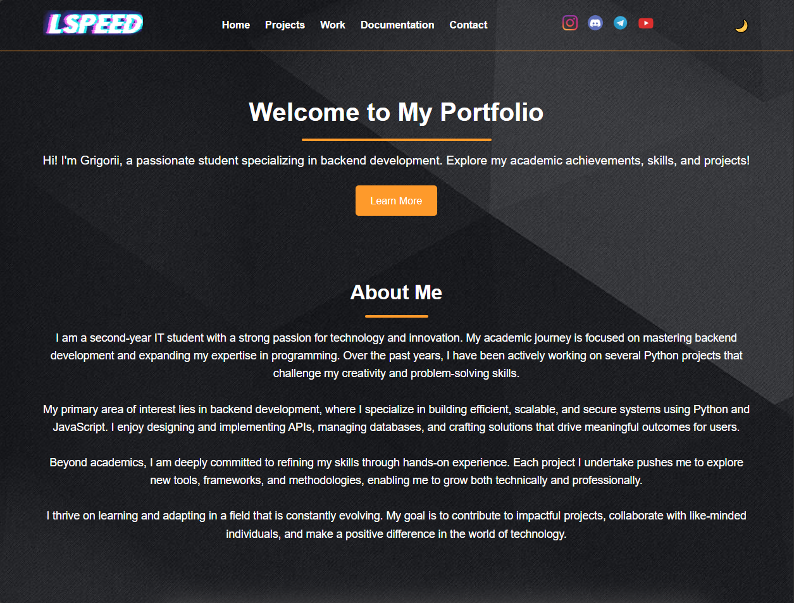
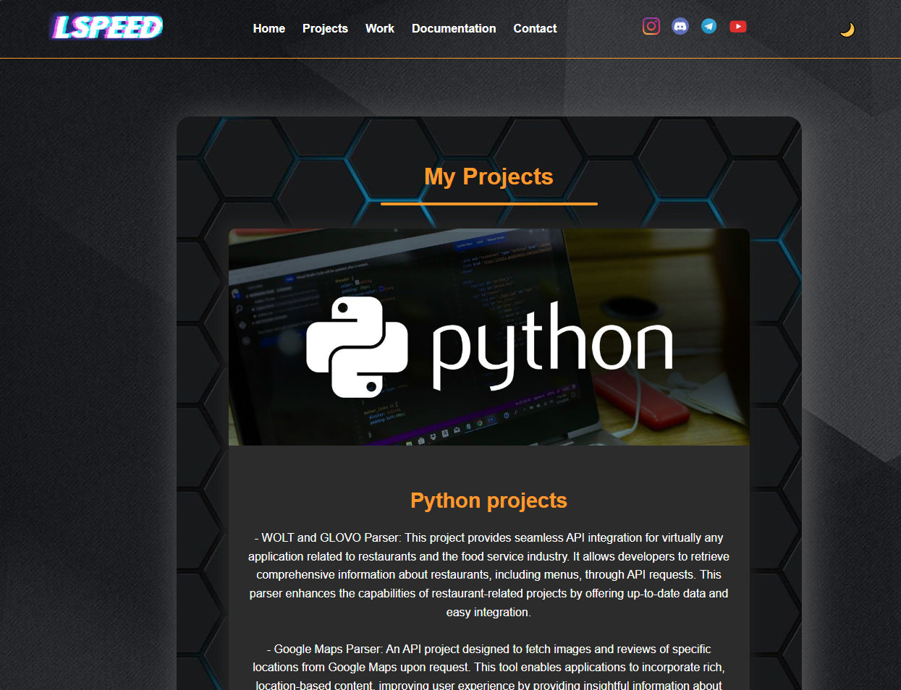
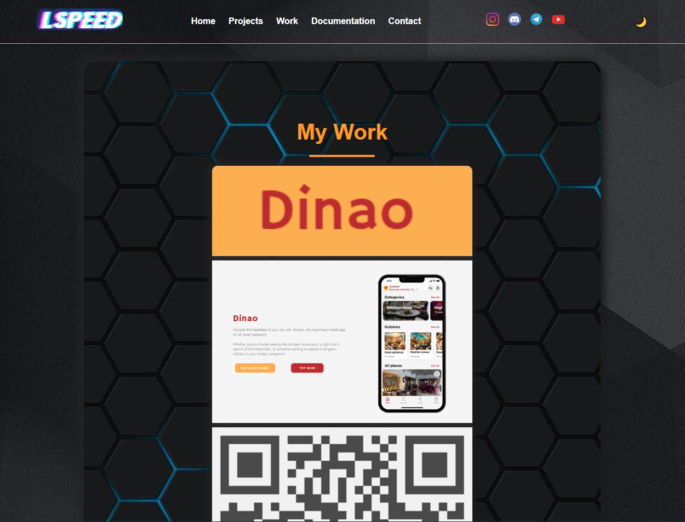
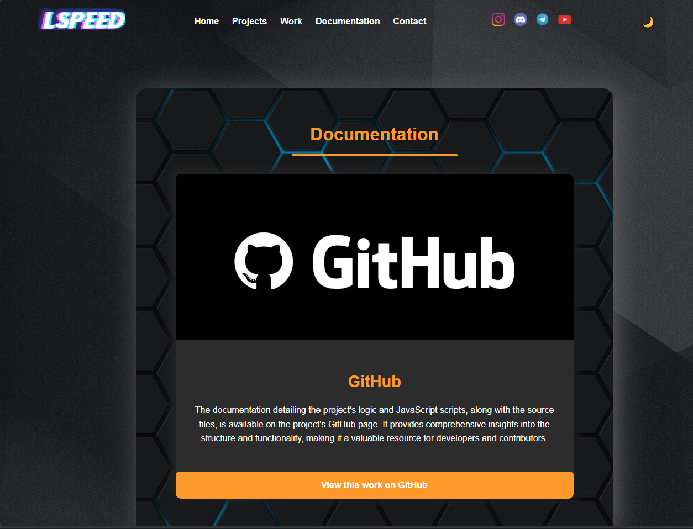
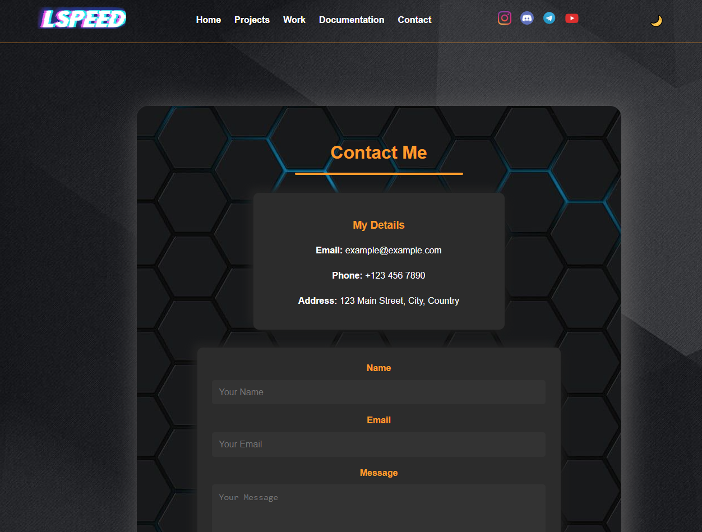

# LSpeed's portfolio Web Design.

## **Theme Toggle Functionality**
```javascript
// Theme toggle functionality
const themeToggle = document.getElementById('themeToggle');
themeToggle.addEventListener('click', () => {
    document.body.classList.toggle('light-theme');
    themeToggle.textContent = document.body.classList.contains('light-theme') ? '☀️' : '🌙';
});
```

### **Description**
This script implements a **theme toggle** feature, allowing users to switch between a **dark theme** (default) and a **light theme**.

### **Logic**
1. **Select the Theme Toggle Button**  
   The button is identified using its `id="themeToggle"`.

2. **Event Listener for Button Click**  
   When the button is clicked:
   - It toggles the `light-theme` class on the `<body>` element.  
   - If the class exists, it switches to the **light theme**; otherwise, the **dark theme** is applied.

3. **Dynamic Button Text**  
   - If the theme is light, the button shows the `☀️` icon.  
   - If the theme is dark, the button shows the `🌙` icon.

### **Purpose**
This feature enhances **usability** by allowing users to customize the visual style of the website.

---

## **Scroll Animation for Sections**
```javascript
document.addEventListener("DOMContentLoaded", function () {
    const sections = document.querySelectorAll(".home-section");

    const handleScroll = () => {
        sections.forEach((section) => {
            const rect = section.getBoundingClientRect();
            if (rect.top >= 0 && rect.top <= window.innerHeight) {
                section.classList.add("animate");
            }
        });
    };

    // Listen for scroll events
    window.addEventListener("scroll", handleScroll);

    // Run on initial page load
    handleScroll();
});
```

### **Description**
This script applies a **scroll animation** to sections of the page, making them appear or animate as they enter the viewport.

### **Logic**
1. **Detect Sections**  
   The script selects all elements with the `.home-section` class.

2. **Scroll Event Listener**  
   It listens for the `scroll` event on the window.

3. **Animation Logic**  
   - When the page is scrolled, the script checks each section's position using the `getBoundingClientRect()` method.
   - If the section's top edge is visible within the viewport (`rect.top >= 0` and `rect.top <= window.innerHeight`), it adds the `.animate` class to that section.

4. **Initial Execution**  
   The `handleScroll` function is called when the page is loaded to immediately handle any sections that are already visible.

### **Purpose**
The purpose of this script is to enhance the user experience by adding smooth animations to sections as they come into view during scrolling.

# Pages Documentation.



# Index Page Overview

The **Index Page** serves as the landing page of the portfolio website, providing visitors with a welcoming introduction and a summary of the owner's expertise and professional focus. Below is an overview of its functionality and content:

## **Key Features**
- **Header Navigation**: 
  - Contains a clickable logo that redirects to the homepage.
  - Includes links to major sections of the site: Projects, Work, Documentation, and Contact.
  - Social media icons for quick access to platforms such as Instagram, Discord, Telegram, and YouTube.
  - A theme toggle button (🌙/☀️) to switch between light and dark modes.

- **Welcome Section**:
  - A warm introduction with the headline "Welcome to My Portfolio".
  - A brief description of the owner's academic background and professional focus in backend development.
  - A call-to-action button ("Learn More") to encourage users to explore further.

- **About Me Section**:
  - A detailed paragraph highlighting the owner's journey as a second-year IT student.
  - Focus on backend development, programming expertise, and hands-on experience in building APIs, databases, and secure systems.
  - A narrative of continuous learning and adapting to evolving technology to make a meaningful impact.

## **Design Highlights**
- **Responsive Layout**: Ensures compatibility across devices and screen sizes.
- **Visual Styling**:
  - A modern dark-themed design with a toggle for light mode.
  - Subtle animations and accent lines for section headers to enhance user engagement.

## **Purpose**
The Index Page aims to create a professional first impression and guide visitors to explore other sections of the portfolio website.



# Projects Page Overview

The **Projects Page** showcases key Python-based projects developed by the portfolio owner. Each project is highlighted with a title, a description, and an image to provide visual and textual context.

## **Key Features**
- **Project Showcase**:
  - Each project is displayed as a distinct section with a **project title** and **detailed description**.
  - Accompanied by relevant visuals (e.g., images or icons) to enhance engagement and provide a clear understanding of the project.

- **Highlighted Projects**:
  - **WOLT and GLOVO Parser**:
    - Provides seamless API integration for restaurant-related applications.
    - Retrieves restaurant information, menus, and other essential data via API requests.
  - **Google Maps Parser**:
    - Fetches images and reviews of locations using the Google Maps API.
    - Designed to improve user experience in applications relying on location-based data.

## **Design Highlights**
- **Visual Appeal**:
  - Eye-catching section headers (e.g., "My Projects") styled with custom colors and underlines for emphasis.
  - A modern dark theme with hexagonal patterns in the background.
  - Clear and professional fonts to improve readability.

- **Responsive Design**:
  - Adjusts seamlessly across various devices and screen sizes for optimal viewing.

## **Purpose**
The Projects Page serves to inform visitors about the owner's expertise and contributions in Python development. It demonstrates their ability to create impactful tools for real-world applications and provides insight into their technical capabilities.



# Work Page Overview

The **Work Page** highlights key professional contributions and projects undertaken by the portfolio owner. It is designed to showcase detailed descriptions, visual elements, and relevant information about impactful work experiences.

## **Key Features**
- **Project Highlight**:
  - **Dinao**:  
    - A mobile application aimed at providing users with an intuitive platform to explore restaurants and venues in Belgrade and Novi Sad.
    - The application includes:
      - **Search Filters**: Discover places based on user preferences.
      - **Detailed Menus**: View menus with images for an enhanced dining experience.
      - **User Reviews**: Access authentic feedback from other users.
      - Available on the App Store for iOS devices.

- **Visual Representation**:
  - Features a clean and professional banner showcasing the Dinao logo.
  - Includes screenshots of the app interface for better understanding.
  - A QR code is provided for easy access to the application download page.

## **Design Highlights**
- **Modern Layout**:
  - A bold title, "My Work," styled with a custom underline for emphasis.
  - A dark hexagonal background for a modern and sleek aesthetic.
  - Strategic use of colors (e.g., orange accents) to draw attention to key details.

- **Responsive Design**:
  - Optimized for various devices, ensuring seamless user experience across screens.

## **Purpose**
This page serves to showcase the portfolio owner's professional achievements and technical capabilities. By highlighting real-world applications such as Dinao, it demonstrates the ability to contribute meaningfully to impactful projects while offering value to users.



# Documentation Page Overview

The **Documentation Page** provides comprehensive information about the project's logic, functionality, and JavaScript implementations. It serves as a centralized hub for developers and contributors to explore the project's structure and understand its core elements.

## **Key Features**
- **GitHub Integration**:
  - A visually prominent GitHub logo linking to the repository.
  - A call-to-action button: **"View this work on GitHub"**, allowing users to easily access the repository.

- **Description Section**:
  - Highlights the availability of:
    - Detailed explanations of JavaScript scripts.
    - Source files and logic descriptions.
  - Ensures developers and contributors can gain valuable insights into the project's structure.

## **Design Highlights**
- **Minimalistic Layout**:
  - Focus on essential information with clear visuals.
  - A bold "Documentation" header styled with an orange underline for emphasis.

- **Interactive and Responsive**:
  - Ensures compatibility across devices and screen sizes.
  - Provides a clean and distraction-free interface.

## **Purpose**
This page is designed to:
1. Assist developers and collaborators in understanding the project's functionality.
2. Provide easy access to the repository for further exploration and contributions.
3. Enhance the overall accessibility and transparency of the project's codebase.



# Contact Page Overview

The **Contact Page** provides visitors with a straightforward way to reach out to the portfolio owner. It combines a clean layout with both contact details and an interactive contact form.

## **Key Features**
- **Contact Information**:
  - Displayed in a visually distinct card, the following details are available:
    - **Email**: `example@example.com`
    - **Phone**: `+123 456 7890`
    - **Address**: `123 Main Street, City, Country`

- **Interactive Contact Form**:
  - Fields included:
    - **Name**: To identify the sender.
    - **Email**: To allow replies or further communication.
    - **Message**: To capture the query or feedback.
  - Styled for clarity and ease of use.

## **Design Highlights**
- **Consistent Theme**:
  - Dark hexagonal background aligned with the overall site design.
  - Orange accents for headings and focus areas.

- **Responsive Layout**:
  - Designed to adapt seamlessly to all devices.
  - Clear and user-friendly interaction points.

- **Call-to-Action**:
  - A prominent "Send Message" button encourages users to submit their inquiries.

## **Purpose**
The Contact Page aims to:
1. Establish a direct communication channel between the portfolio owner and visitors.
2. Provide a professional impression through a well-organized and accessible design.
3. Encourage potential collaborations or feedback by offering multiple ways to connect.


